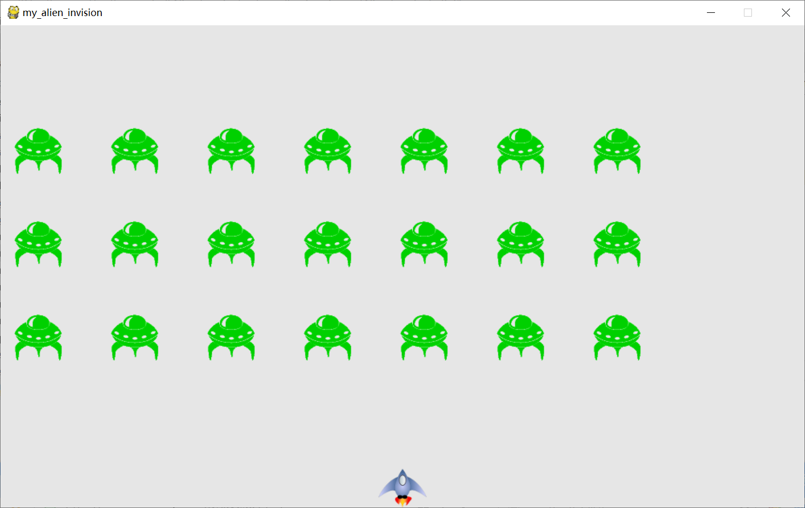
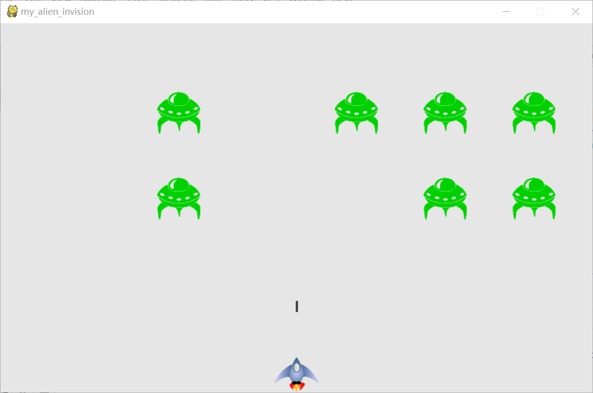
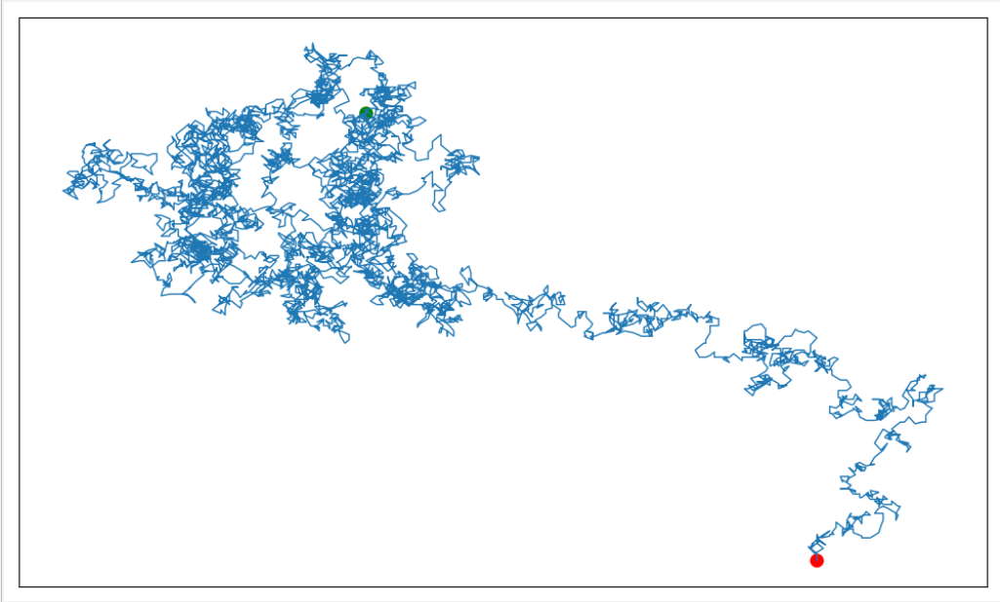
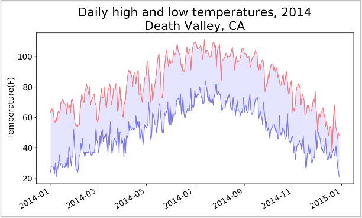
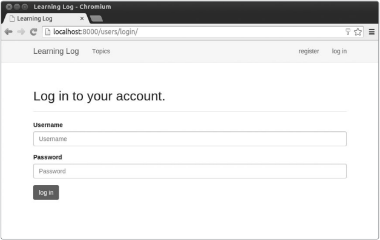

# python projects

In this section, I did three small projects in Python, namely a small game, data visualization, and a blog.

- [Alien invasion](#alien-invasion)
- [Data visualization](#data-visualization)
- [Online journal sysytem](#online-journal-sysytem)

### Alien invasion
In the Alien Invasion project, I use the Pygame package to develop a 2D game in which the aim is to shoot down afleet of aliens as they drop down the screen in levels that increase in speed. and difficulty. The following two are the game's interface.

### Data visualization
In the Data Visualization project, in which I generate data and create a series of functional and beautiful visualizations of that data using matplotlib and Pygal. Then I access data from online sources and feed it into a visualization package to create plots of weather data and a world population map. 

### Online journal sysytem

In this project, i use Django to build a project called Learning Log -- an online journal system that lets you keep track of information you've learned about particular topics.

